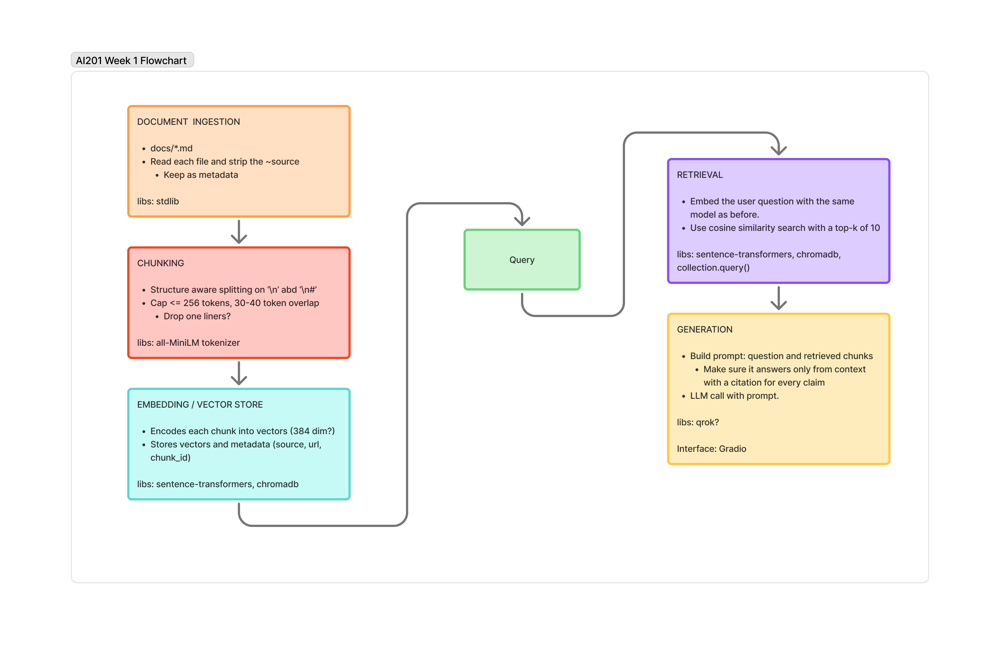

# Project 1 Planning: The Unofficial Guide

> Write this document before you write any pipeline code.
> Your spec and architecture diagram are what you'll use to direct AI tools (Claude, Copilot, etc.) to generate your implementation — the more specific they are, the more useful the generated code will be.
> Update the Retrieval Approach and Chunking Strategy sections if you change your approach during implementation.
> Update this file before starting any stretch features.

---

## Domain

A guide for older students feeling out of place returning to school at the University of Texas at Austin's Computer Science program.

Many universities and program's guidance is created for traditional students who show up at 18 right after high school. If you’re coming back at a later age, 35 for instance, the questions you might have won’t be found directly answered on any .edu page, and are scattered across social media, forums and other unofficial resources. 

This seeks to answer questions like ‘Will I be the only person in my 30’s in the class?’  and subjects such as fitting classes around jobs and shedding the rust of being out of school so long.

---

## Documents

| #  | Source               | Description                                                                                                                                      | URL or location                                                                                |
|----|----------------------|--------------------------------------------------------------------------------------------------------------------------------------------------|------------------------------------------------------------------------------------------------|
| 1  | Reddit               | Older transfer student in their late 30s asking how to deal with feeling out of place and where older students hang out (New Wave Longhorns org) | https://www.reddit.com/r/UTAustin/comments/1njalkz/for_older_nontraditional_students_advice/   |
| 2  | Reddit               | Students describing what's on the UT Math Assessment (UTMA) and how to review for it after time off                                              | https://www.reddit.com/r/UTAustin/comments/1kdmogf/ut_math_assessment_questions/               |
| 3  | Reddit               | Working-class student's account of balancing multiple jobs with school, food insecurity, and UT support resources                                | https://www.reddit.com/r/UTAustin/comments/1bo3s8w/to_be_a_worker_poor_and_a_student/          |
| 4  | Reddit               | Prospective STEM PhD student asking whether the stipend is livable and if second jobs are allowed                                                | https://www.reddit.com/r/UTAustin/comments/196l3qy/do_phd_students_typically_have_second_jobs/ |
| 5  | Instagram            | Senate of College Councils post defining the Non-Traditional Student Scholarship and its eligibility                                             | https://www.instagram.com/p/DAQ4_hiKohH/                                                       |
| 6  | The Daily Texan      | First-person column from a nontraditional student (married, working mom of three) on her path to UT                                              | https://thedailytexan.com/2023/08/07/i-am-proud-of-the-journey-i-took-to-get-to-ut/            |
| 7  | College Confidential | Forum thread on which credits to transfer in, the 60-hour transfer cap, and in-residence requirements                                            | https://talk.collegeconfidential.com/t/transferring-college-credits/1706757                    |
| 8  | College Confidential | Forum thread on establishing Texas residency to qualify for in-state tuition                                                                     | https://talk.collegeconfidential.com/t/establishing-in-state-residency/1775711                 |
| 9  | modalshift.co        | Review of UT's online MSDS/MSCS program with cost, admissions, format, and course ratings                                                        | https://modalshift.co/msdso-review/                                                            |
| 10 | 921kiyo.com          | A person's experience of UT's online MSCS program                                                                                                | https://921kiyo.com/ut-austin-cs-online/                                                       |

---

## Chunking Strategy

**Chunk size:**
<=256

**Overlap:**
30-40 tokens

**Reasoning:**
The text itself is a mixture of social media conversations, with the inclusion of a couple longer form essays and articles. 

The chunk size should end up being less than 256 tokens since I'm using all-MiniLM-L6-v2. 

I want to start with a 30-40 token overlap, since this is shorter content on average and isn't something like a novel.

---

## Retrieval Approach

<!-- Which embedding model are you using (e.g., all-MiniLM-L6-v2 via sentence-transformers)?
     How many chunks will you retrieve per query (top-k)?
     If you were deploying this for real users and cost wasn't a constraint, what tradeoffs
     would you weigh in choosing a different embedding model — context length, multilingual
     support, accuracy on domain-specific text, latency? -->

**Embedding model:**
all-MiniLM-L6-v2 via sentence-transformers

**Top-k:**
10 (for now) It's a bit of a guess, but it's a small corpus and smaller chunks.

**Production tradeoff reflection:**
If this were a real world application, I would want to use a higher top-k across a larger set of documents.

I would also want to use a larger embedding model, too. I'm limited by the context length of the model, and the technical resources available to me.

There are other considerations, too. Everything in my corpus is in English, so I would want to use a multilingual model.

I would also want to use a model that's been fine-tuned on a domain-specific task, instead of a general-purpose model as I am. We'd want the domain accuracy to be as high as possible. I'd prefer to chunk on boundaries but I'm limited.

---

## Evaluation Plan

<!-- List your 5 test questions with their expected correct answers.
     Questions should be specific enough that you can judge whether the system's response
     is right or wrong. "What are good dining halls?" is too vague.
     "What do students say about wait times at [dining hall name] during lunch?" is testable. -->

| # | Question                                                                             | Expected answer                                                                                                          |
|---|--------------------------------------------------------------------------------------|--------------------------------------------------------------------------------------------------------------------------|
| 1 | Is Reinforcement Learning a good course to take online?                              | No — students found it disappointing: brief lectures, textbook-driven; they recommend the David Silver lectures instead. |
| 2 | How much will I actually interact with professors and classmates online?             | Very little — mostly Slack/Piazza/Discord and TA-run office hours; you have to start study groups yourself.              |
| 3 | What topics are on the UT Math Assessment, and how should I prepare after years off? | Mostly Algebra I/II and precalc (some trig, a little calc); a practice exam and review modules are provided.             |
| 4 | Can a PhD student live on the UT stipend, and are second jobs allowed?               | ~$2,400/mo is tight but livable; second jobs are usually barred by contract — extra TA/RA hours (up to 30) are the way.  |
| 5 | How do I establish Texas residency to qualify for in-state tuition?                  | Live in Texas 12 consecutive months and maintain 'domicile via gainful employment' (student jobs don't count).           |

---

## Anticipated Challenges

<!-- What could go wrong? Name at least two specific risks with reasoning.
     Consider: noisy or inconsistent documents, missing source attribution, off-topic
     retrieval, chunks that split key information across boundaries. -->

1. My document lengths are inconsistent and I'm not sure how well I've landed on my chunking planning. It was a bit of a guess.

2. I'm a bit interested in the ranking process. I don't have a lot of experience with it, so I'll need to research and understand how it works.

---

## Architecture

<!-- Draw a diagram of your pipeline showing the five stages:
     Document Ingestion → Chunking → Embedding + Vector Store → Retrieval → Generation
     Label each stage with the tool or library you're using.
     You can use ASCII art, a Mermaid diagram, or embed a sketch as an image.
     You'll use this diagram as context when prompting AI tools to implement each stage. -->

---

## AI Tool Plan

<!-- For each part of the pipeline below, describe:
     - Which AI tool you plan to use (Claude, Copilot, ChatGPT, etc.)
     - What you'll give it as input (which sections of this planning.md, which requirements)
     - What you expect it to produce
     - How you'll verify the output matches your spec

     "I'll use AI to help me code" is not a plan.
     "I'll give Claude my Chunking Strategy section and ask it to implement chunk_text()
     with my specified chunk size and overlap" is a plan. -->

**Milestone 3 — Ingestion and chunking:**

**Milestone 4 — Embedding and retrieval:**

**Milestone 5 — Generation and interface:**
